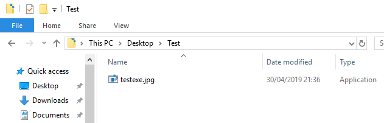

## RTLO.py (Right to left override)

rtlo.py is a script that takes a file (usually executable) and appends a Unicode right to left override character to disguise the real file extension.

## Usage

```shell
root@kali:~# python rtlo.py evil.exe jpg

[+] RTLO file created!
```



